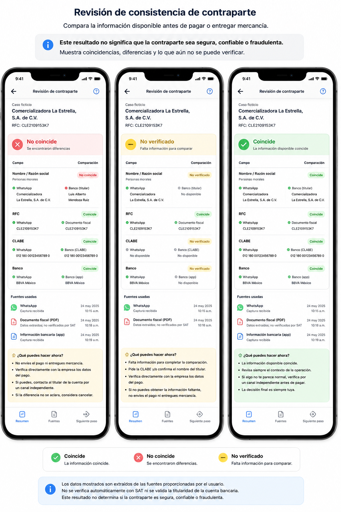
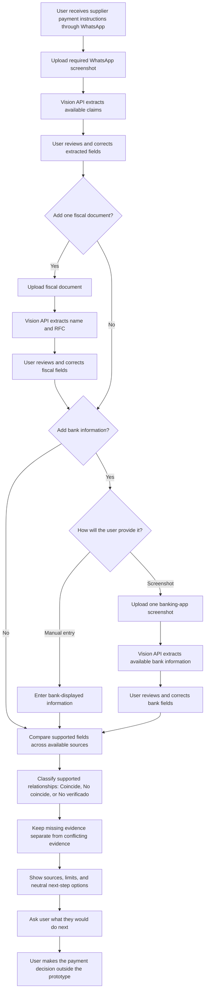

# Week 3 — Business Bending Packet

## Working direction
Pre-payment counterparty consistency for small Mexican businesses transacting through WhatsApp.

## Blueprint alignment
This Packet is aligned to the Week 3 Team Blueprint and its five conditions, including the Shadow Clause.

## Problem in my words

Small Mexican businesses often make payments to suppliers or new contacts through conversations that happen on WhatsApp. Before paying, they may have different pieces of information, like a business name, an RFC, a fiscal document, or payment details, but this information is separated and difficult to compare.

The problem is not simply knowing if the person is "real." The problem is noticing when the available information does not fit together before the business sends money or releases goods.

## Exact user

A person who owns or works at a small Mexican business, does not have a dedicated fraud team, and uses WhatsApp to communicate with suppliers or new counterparties.

The exact moment is after they receive the counterparty identity and payment information, but before they send money or release goods.

They need a simple way to compare the evidence they already have and notice important inconsistencies without being told that a person or business is "safe" or "fraud."

## Success definition

Before the module closes:

- The user can upload one required WhatsApp screenshot and optionally provide one fiscal document and one source of bank information.
- The prototype extracts the available fields and lets the user review and correct them before comparison.
- The system compares only corresponding fields supported by the available evidence.
- Missing information stays different from conflicting information.
- Every result shows its source and does not claim that the counterparty is safe, trusted, or fraudulent.
- Fiscal-document information is labeled as extracted, not SAT-verified.
- Bank information is not presented as authoritative account-owner verification unless the prototype actually has that capability.
- The prototype gives the user a clear next step before payment or release of goods.
- Persona testing checks what the user would do after seeing the result, not only whether they understand it.
- At least one test case uses legitimate but incomplete or non-standard evidence to check that missing verification does not automatically create suspicion.

## Image-generated mockup

The mockup below shows the proposed mobile results experience in Spanish. It keeps evidence sources visible, separates missing evidence from conflicting evidence, and avoids SAFE, FRAUD, or trust judgments.

## Flowchart

## Swimlane

# Week 3 — Swimlane

```mermaid
flowchart LR

    subgraph U["USER"]
        direction TB
        U1["Uploads required WhatsApp screenshot"]
        U2["Reviews and corrects extracted claims"]
        U3["Optionally uploads one fiscal document"]
        U4["Reviews and corrects fiscal fields"]
        U5["Optionally enters bank information or uploads one screenshot"]
        U6["Reviews and corrects bank fields"]
        U7["Reads comparisons, sources, limits, and next-step options"]
        U8["States what they would do next"]
        U9["Makes payment decision outside the prototype"]
    end

    subgraph P["PROTOTYPE"]
        direction TB
        P1["Validates the WhatsApp upload"]
        P2["Displays extracted claims as editable fields"]
        P3["Accepts up to one optional fiscal document"]
        P4["Displays fiscal fields as extracted, not SAT-verified"]
        P5["Accepts one bank source by manual entry or screenshot"]
        P6["Displays entered or extracted bank fields without claiming account-owner verification"]
        P7["Compares only supported corresponding fields"]
        P8["Keeps missing evidence separate from conflicting evidence"]
        P9["Classifies and explains bounded evidence relationships"]
    end

    subgraph V["VISION API"]
        direction TB
        V1["Extracts available WhatsApp claims"]
        V2["Extracts name and RFC from fiscal document"]
        V3["Extracts available information from banking-app screenshot"]
    end

    U1 --> P1
    P1 --> V1
    V1 --> P2
    P2 --> U2

    U2 --> U3
    U3 -->|If provided| P3
    P3 --> V2
    V2 --> P4
    P4 --> U4

    U2 -->|If no fiscal document| U5
    U4 --> U5

    U5 -->|Manual entry| P5
    U5 -->|Screenshot| P5
    P5 -->|Screenshot only| V3
    V3 --> P6
    P5 -->|Manual entry| P6
    P6 --> U6

    U5 -->|If no bank information| P7
    U6 --> P7

    P7 --> P8
    P8 --> P9
    P9 --> U7
    U7 --> U8
    U8 --> U9


```

## Benchmark

**Best existing solution on Earth:** The UK's Confirmation of Payee (CoP), which checks whether the account name entered by a payer matches the name held by the receiving payment provider before a payment is made.

**Mine differs or localizes by:** This prototype applies the pre-payment comparison principle to small Mexican businesses transacting through WhatsApp, using evidence the user can actually provide instead of claiming direct access to authoritative bank-account ownership data.

## Long view

If this slice works, the product could become a pre-payment evidence layer for small businesses that helps them compare counterparty information before sending money or releasing goods. Over three years, it could support more transaction channels and stronger evidence sources if reliable integrations become available, while keeping the source and uncertainty of every result visible. It would still never use a trust score or automatically label a person or business as safe, fraudulent, or trustworthy.

## Scope cut

This working slice is intentionally narrow.

### In scope

- One required fictional WhatsApp screenshot.
- Up to one optional fictional fiscal document.
- Up to one optional bank-information source, provided manually or through a fictional banking-app screenshot.
- Vision AI extraction from uploaded images/documents.
- User review and correction of extracted fields.
- Deterministic validation and comparison of supported fields.
- Clear source labels and uncertainty.
- Neutral next-step guidance before the user makes the payment decision.
- Fictional demo and persona-test cases only.

### Not building

- Universal CLABE-owner verification.
- SAT authentication of fiscal documents.
- WhatsApp account ownership verification.
- Deepfake, voice-clone, biometric, or document-forgery detection.
- Trust, safety, fraud, or legitimacy scores.
- Automatic payment approval, rejection, blocking, or transfer execution.
- Bank, SAT, SPEI, or WhatsApp integrations that are not actually available to the prototype.
- User accounts, database storage, or long-term persistence.
- Real personal or financial data.

## Architecture and stack

| Layer | Technology | Purpose |
| --- | --- | --- |
| Front end | Next.js + TypeScript + Tailwind CSS | Mobile-first interface for uploads, review, comparisons, and results |
| Vision | Multimodal vision API | Extract available fields from fictional screenshots and documents |
| Validation | TypeScript deterministic utilities | Validate supported formats such as RFC and CLABE when available |
| Comparison | TypeScript deterministic rules | Compare corresponding fields across available evidence |
| Explanation | Fixed Spanish templates | Explain results, uncertainty, sources, and neutral next steps |
| Storage | None | No application-level persistence in this working slice |
| Deployment | Vercel | Deploy the working prototype |
| Secrets | Vercel environment variables | Keep API credentials out of the repository |

## Security floor

- API keys will exist only in environment variables and never in the repository.
- The prototype will not intentionally store uploaded images or extracted personal information.
- Because this slice has no application-level persistence of personal data, it does not require user accounts or a Supabase user-data table.
- Every upload and manual input will have file, type, length, and format validation where applicable.
- All demo and test information will be fictional and labeled as such.
- Simulated AI output, if used, will be clearly labeled on screen.

## Test plan

### Mechanical pass

The prototype will be tested with fictional data only.

#### Test 1 — Clear inconsistency

Provide evidence where an important corresponding field conflicts across two sources.

**Expected result:** The prototype identifies the specific inconsistency, shows which sources produced it, and does not call the counterparty fraudulent or unsafe.

#### Test 2 — Consistent evidence

Provide two usable sources with corresponding information that is consistent.

**Expected result:** The prototype shows the supported consistency without telling the user that the counterparty is safe, trusted, or legitimate.

#### Test 3 — Insufficient evidence

Provide only the required WhatsApp screenshot with no usable second source for comparison.

**Expected result:** The prototype keeps the result unresolved or unverified rather than treating missing evidence as suspicious.

#### Test 4 — Legitimate but messy evidence

Provide a fictional legitimate case with incomplete or differently named evidence, such as a commercial name that differs from the legal or banking name.

**Expected result:** The prototype explains the uncertainty or difference without automatically treating the counterparty as suspicious. This test directly checks the Blueprint Shadow Clause.

#### Test 5 — Invalid or incomplete input

Provide an unsupported file, malformed field, missing required input, or invalid RFC/CLABE format where applicable.

**Expected result:** The prototype rejects or flags the invalid input clearly and does not invent missing information.

#### Test 6 — User correction

Allow the vision system to extract a field incorrectly, then correct it manually before comparison.

**Expected result:** The corrected user-reviewed value is used in the comparison and the interface makes the correction clear.

#### Test 7 — Capability boundaries

Use a fiscal document and bank-information source.

**Expected result:** Fiscal information is described as extracted rather than SAT-authenticated, and bank information is not presented as authoritative account-owner verification.

### Bug-fix requirement

During the mechanical pass, I will document at least one real bug or failure, fix it, rerun the relevant test, and redeploy the corrected version.

### Persona test

I will open a fresh chat with a synthetic user based on the target user: a person who works at a small Mexican business, uses WhatsApp for supplier communication, does not have a fraud team, and is not an expert in verification technology.

I will show the persona screenshots of the working prototype in order and ask the persona to complete the task while explaining where they hesitate, what they understand, and where they might stop using the product.

The persona test will specifically check:

- whether the user understands what each result does and does not establish;
- whether missing evidence is interpreted as suspicious;
- whether a consistency result creates false confidence;
- whether a legitimate but incomplete or non-standard case creates unfair suspicion or friction;
- whether the user understands the source of each piece of information;
- whether the user knows what reasonable next action is available;
- whether the result changes the user's next action before the transaction;
- where evidence collection or additional steps create too much friction.

I will log every important confusion and fix the worst one before the final redeploy.

## Blueprint condition mapping

- **Condition 1 — Evidence boundaries:** Results remain limited to the relationships supported by the available evidence.
- **Condition 2 — Actionable at the decision point:** The prototype and persona test examine what the user does next before payment or release of goods.
- **Condition 3 — Economic actor and value:** The individual build does not claim a validated payer or standalone business model; payer, value, and platform placement remain open hypotheses for testing.
- **Condition 4 — Shadow Clause:** Missing, informal, incomplete, or non-standard evidence is tested as uncertainty rather than negative evidence.
- **Condition 5 — Control the value you claim:** The prototype uses only realistically accessible capabilities and clearly separates extraction, validation, comparison, and authoritative verification.

